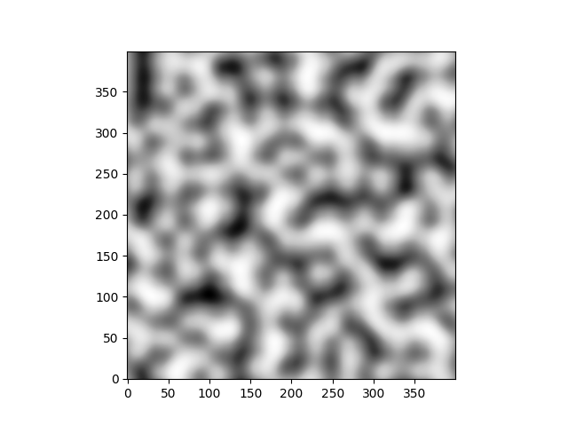

# Perlin noise
2D Perlin noise in Python and a Jupyter Notebook visualizing the algorithm.

<div style="text-align:center"></div>

# How to use
``` 
pip install -r requirements.txt 
python perlin_noise.py
```
